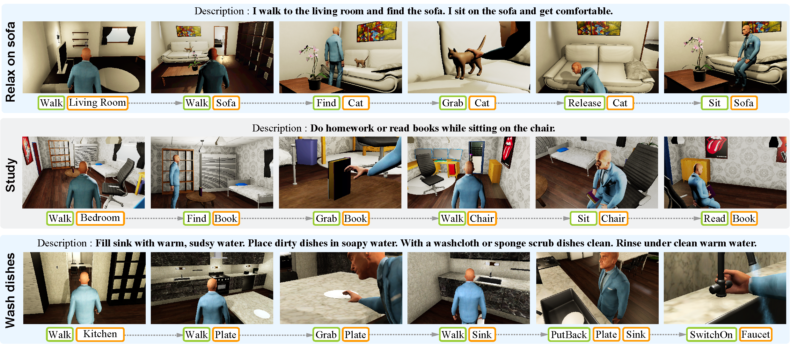

# Scene-aware Activity Program Generation with Language Guidance
Source codes of SIGGRAPH Asia 2023 Paper : "Scene-aware Activity Program Generation with Language Guidance"



## Environment Setup

### Create a conda environment

```bash
conda create -n LVHomeEnv python=3.11
conda activate LVHomeEnv
git clone https://github.com/ToddBear/LangGuidedProgram
cd LangGuidedProgram
pip install -r requirements.txt
```

### Data Preparation

```bash
cd ..
mkdir Data
```

Download the program dataset [here](http://virtual-home.org), and organize it as follows:

```
Data
└── augment_programs
    ├── augment_exception
    └── augment_location
└── original_programs
```

Download the pre-computed future link for training the adjacency constraint moduel, and place it in Data folder:

```
Data
└── future_link.pkl
```

## Training

Run the following scrips:

```bash
cd LangGuidedProgram/src
sh train.sh
```

## Testing

Download the pre-trained weights, put it into the LangGuidedProgram/output folder, and run test.sh:

```bash
cd LangGuidedProgram/src
sh test.sh
```

If you find the code useful in your research, please consider citing:

```
@article{su2023scene,
  title={Scene-aware Activity Program Generation with Language Guidance Supplementary Material},
  author={Su, Zejia and Fan, Qingnan and Chen, Xuelin and Van Kaick, Oliver and Huang, Hui and Hu, Ruizhen},
  journal={ACM Trans. Graph},
  volume={42},
  number={6},
  year={2023}
}
```

## Acknowledgments

Our project is build upoon [VirtualHome](https://github.com/xavierpuigf/virtualhome_unity) and [ResActGraph](https://github.com/andrewliao11/env-aware-program-gen). Thanks for your great constributions!